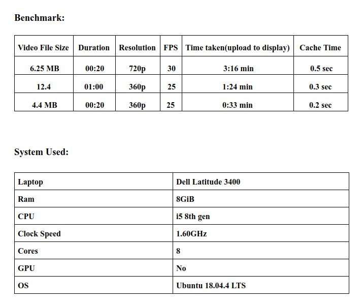
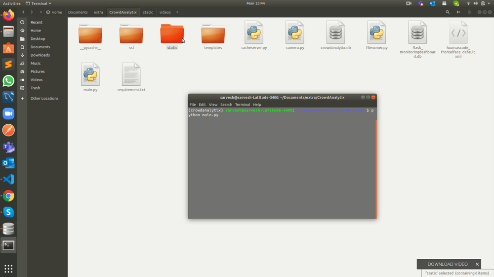

# FaceDetector    
A flask webapp to detect faces in a mp4 video. The web app is SSL protected and has a cache server which keeps track of already uploaded videos and are stored on the server. 

## Description: 
The webapp is run on flask with a html front end. The user is prompted to upload a video of mp4 format. On clicking "submit files" the app checks if the uploaded file 
already exists on the server with use of sqlitedb3 which stores the path to the file. The video is then converted into frames of images and stored into a folder and each image is 
then scanned for images using opencv and necessary adjustments to the image are done , this process is repeated till all frames have been scanned and all frames are combined to make a video using ffmpeg codec and 
is displayed on the webpage. 

## Front_End: 
HTML, CSS, JS  

## Back_End: 
Python, Flask  

## Database 
sqlite3

## Libraries_used: 
opencv, glob, numpy, cors, ffmpeg(codec)   

## RUN: 

1. Clone the repo   
2. Create environment  
3. pip install -r requirements.txt  
4. python main.py  

## Benchmark:

## Demo:  

